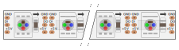

A Fritzing part for the Pololu WS2812B 60/m LED Strip: <http://www.pololu.com/product/2549>

Based on the NeoPixel 60/m strip (neo60M_W) part provided by Adafruit: <https://github.com/adafruit/Fritzing-Library/tree/master/parts>

